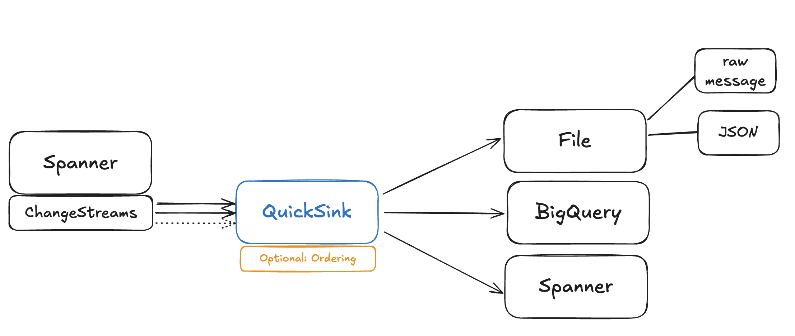

# Spanner QuickSink



Multi-Threaded application to read Google Spanner ChangeStreams and emit them to various sinks (e.g. File, Spanner).
The app supports the option of using ordering events to ensure transactions can be processed downstream in strict commit order. This is relevant for use cases where one wants to replicate changes with transactional consistency. 

> **Disclaimer**: This tool is provided "as-is" for development, testing, and debugging purposes. It is **not** intended for critical production workloads or strict SLA environments. Use at your own risk.

### Use Cases
- Dumping Spanner ChangeStream events to files for development, debugging & investigation
- Replicating tables between Spanner databases & instances

### Features
- **Flexible Sinks**: Supports writing raw JSON, generating SQL, replicating directly **to Spanner**, or streaming **to BigQuery**.
- **Ordered Buffering**: Reorders transactions by commit timestamp to ensure consistency when replayed on other systems.
- **Metrics**: Real-time console reporting of throughput (Recvd/Sinked) and processing lag.
- **Resilience**: Handles partition splits, temporary irregularities and automatically retries with adjusted timestamps for new partitions.

### Prerequisites
- Java 17+
- Maven 3.8+

### Build and Run

```bash
# Build
mvn -q -e -DskipTests package

# Run
mvn -q exec:java -Dexec.args="--config config/my-app.properties"
```

### Quickstart

**`config/sink_to_file.properties`**
Tail a Spanner ChangeStream and dump records to a local JSON file (no buffering, raw output):

```properties
# Source Spanner DB
projectId=my-gcp-project
instanceId=my-spanner-instance
databaseId=my-database
changeStream=my_change_stream

# Output to File
sink.type=file
sink.path=events.jsonl

# Disable buffering for immediate output
buffer.enabled=false

# Console Logging (1=Info)
console.logLevel=1
```

**`config/sql_sink.properties`**
Convert Spanner ChangeStream to SQL INSERT/UPDATE/DELETE statements and dump to a local file (with ordering):

```properties
# Source Spanner DB
projectId=my-gcp-project
instanceId=my-spanner-instance
databaseId=my-database
changeStream=my_change_stream

# Output SQL INSERT/UPDATE/DELETE statements to file
sink.type=sql
sink.path=data_dump.sql

# Enable Buffering to reorder transactions by commit timestamp
buffer.enabled=true
# Wait up to 5s for late transactions
buffer.windowMs=5000
# Flush sorted transactions every 1s
buffer.flushIntervalMs=1000

console.logLevel=1
```

**`config/spanner_replication.properties`**
Replicate changes from one Spanner database to another in strict commit timestamp order, using parallel writers for high throughput:

```properties
# Source Spanner DB
projectId=source-project-id
instanceId=source-instance
databaseId=source-database
changeStream=my_change_stream

# Sync to Target Spanner DB
sink.type=spanner
sink.spanner.projectId=target-project-id
sink.spanner.instanceId=target-instance
sink.spanner.databaseId=target-database

# Performance Tuning
sink.spanner.batchSize=1000
# Writes to target in parallel threads
sink.spanner.parallelism=8

# Ordered Replication (Strict Consistency)
buffer.enabled=true
buffer.windowMs=5000
buffer.flushIntervalMs=1000

console.logLevel=1
```

**`config/bigquery_sink.properties`**
Stream changes to BigQuery tables (Append-Only):

```properties
# Source Spanner DB
projectId=source-project-id
instanceId=source-instance
databaseId=source-database
changeStream=my_change_stream

# BigQuery Sink
sink.type=bigquery
sink.bigquery.projectId=target-gcp-project
sink.bigquery.dataset=target_dataset

# Optional: Custom Table Mapping (source=target)
# sink.bigquery.table.Users=RawUsers

# Enable Buffering
buffer.enabled=true
buffer.windowMs=5000
buffer.flushIntervalMs=1000

console.logLevel=1
```

### Configuration
Create a properties file - Template can be found in `config/example.properties`.

#### 1. Basic Connection
All configurations require the Spanner source connection details:
```properties
projectId=source-project-id
instanceId=source-instance
databaseId=source-database
changeStream=my_stream_name
# Optional: 'google' (default) or 'postgres'
dialect=google
# Optional: Start reading from N minutes ago (default: 5)
startOffsetMinutes=5
# Optional: Change stream heartbeat interval in ms (default: 10000)
heartbeatMs=10000
```

#### 2. Sink Options

**Option A: File Sink (Dump as JSON)**
Writes raw change stream records to a file.
```properties
sink.type=file
sink.path=output.jsonl
```

**Option B: SQL Sink (Generate SQL)**
Generates `INSERT`, `UPDATE`, `DELETE` statements which then are written to a file. 
*Note: Uses `INSERT OR UPDATE` for resilience.*
```properties
sink.type=sql
sink.path=output.sql
```

**Option C: Spanner Execution Sink (Direct Replication)**
Replicates ChangeStream events to a set target Spanner database.
```properties
sink.type=spanner
sink.spanner.projectId=target-project-id
sink.spanner.instanceId=target-instance
sink.spanner.databaseId=target-database
sink.spanner.batchSize=50
# Optional: Number of parallel writer threads (default: 1)
sink.spanner.parallelism=8
# Optional: Timeout for flush operations (default: 60)
sink.spanner.flushTimeoutSeconds=60
```

**Option D: BigQuery Sink (Append-Only)**
Streams changes to BigQuery tables using `insertAll`.
*   **Schema Requirement**: Target tables must exist. Columns (except PKs) must be **NULLABLE** to support DELETEs.
*   **Metadata**: You must pre-create `_spanner_op` (STRING) and `_spanner_commit_timestamp` (TIMESTAMP) columns.

```properties
sink.type=bigquery
sink.bigquery.dataset=target_dataset
# Optional: Map Spanner table names to specific BigQuery tables
sink.bigquery.table.Users=RawUsers
sink.bigquery.table.Orders=RawOrders
# Optional: Max rows per batch to insert (default: 500)
sink.bigquery.batchSize=500
# Optional: Number of parallel writer threads (default: 4)
sink.bigquery.parallelism=4
```

**State Reconstruction (Deduplication)**:
Since the sink is append-only, use the following SQL pattern in BigQuery to view the latest state (excluding deleted rows):

```sql
SELECT * EXCEPT(_row_num, _spanner_op, _spanner_commit_timestamp)
FROM (
  SELECT *,
    ROW_NUMBER() OVER (
      PARTITION BY [PRIMARY_KEY_COLUMNS] 
      ORDER BY _spanner_commit_timestamp DESC
    ) as _row_num
  FROM `my-project.target_dataset.MyTable`
)
WHERE _row_num = 1 AND _spanner_op != 'DELETE'
```

#### 3. Event Ordering (Buffer)
Enable buffering to ensure transactions are processed in strict commit order and batched efficiently.

*   **`buffer.enabled`**: Set to `true` to enable reordering. If `false`, records are emitted immediately as they arrive (potentially out of order).
*   **`buffer.windowMs`**: The reordering window duration (default 5000ms). Records are held for this duration to allow out-of-order events from other partitions to arrive and be sorted.
    *   *Trade-off*: Higher values ensure correctness during high latency or partition splits but increase real-time syncing latency.
*   **`buffer.flushIntervalMs`**: How often the buffer emits "ready" sorted records to the sink (default 1000ms).

```properties
# Buffer Configuration
buffer.enabled=true
buffer.windowMs=5000
buffer.flushIntervalMs=1000
```

#### 4. Console Logging
Control the verbosity of the application output.

```properties
# 1 = Info (Partitions + Metrics)
# 2 = Debug (Buffer/Batch Status)
# 3 = Trace (Full Records)
console.logLevel=1

# Optional: Force full record tracing (equivalent to logLevel=3)
# console.printRecords=true
```

### Spanner Sink - Performance Remarks & Considerations

To maximize write throughput while maintaining data consistency, the Spanner Sink utilizes **Key-Based Sharding**.

Incoming `INSERT`/`UPDATE`/`DELETE` records are **hashed** based on their Primary Key (extracted from the change stream record) and assigned to one of `N` parallel worker threads.

**Key Benefits:**
1.  **Ordered Correctness**: By pinning each Primary Key to a specific thread, all operations for that specific row are processed sequentially. This prevents race conditions and guarantees that the sink preserves the exact timeline of changes for every entity.
2.  **Latency Hiding & Scalability**: While one thread is blocked waiting for Spanner to commit a batch, other threads can continue processing and submitting batches for *different* keys. This removes "head-of-line blocking" for disjoint data.

**Configuration:**
```properties
# Number of parallel writer threads (default: 1)
sink.spanner.parallelism=8

# Timeout for flush operations (default: 60)
sink.spanner.flushTimeoutSeconds=60
```

### 5. Metrics
The application outputs real-time metrics every 2 seconds to help you monitor throughput and latency.

**Example Output:**
`[STATS] Recvd: 1250.5/s (Tot:54002) | Sinked: 1248.2/s (Tot:53980) | Buffered: 22 | Lag: Process 55.2 ms / Data 1205.5 ms | Threads: Partitions: 4, Spanner: 8, Buffer: 1, Other: 5`

**Explanation:**
- **Recvd**: Number of row changes (mods) read from the change stream per second.
- **Sinked**: Number of row changes written to the sink per second.
- **Buffered**: Current number of records waiting in the reordering buffer.
- **Lag: Process**: Internal latency (Time from reading record -> Writing to sink).
- **Lag: Data**: End-to-end data freshness (Time from Spanner Commit -> Writing to sink).
- **Threads**: Breakdown of active threads (Readers, Writers, Buffer Manager).


### Troubleshooting

- **INVALID_ARGUMENT (start_timestamp)**: If you see an error about `start_timestamp` validation, the tool usually auto-detects this and retries with the correct timestamp.
- **ALREADY_EXISTS**: The Spanner sink uses `INSERT OR UPDATE` (UPSERT) to handle replaying data safely.
- **No Data**: Ensure your `startOffsetMinutes` (default 1) covers the time when data was written. Spanner Change Streams are real-time; standard queries won't see historical data unless you use a snapshot.
